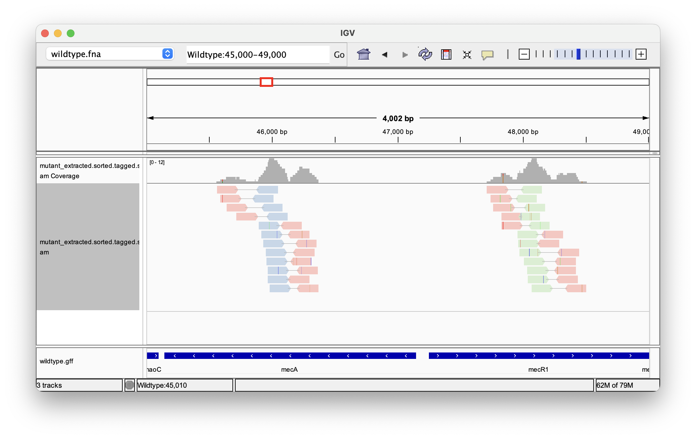
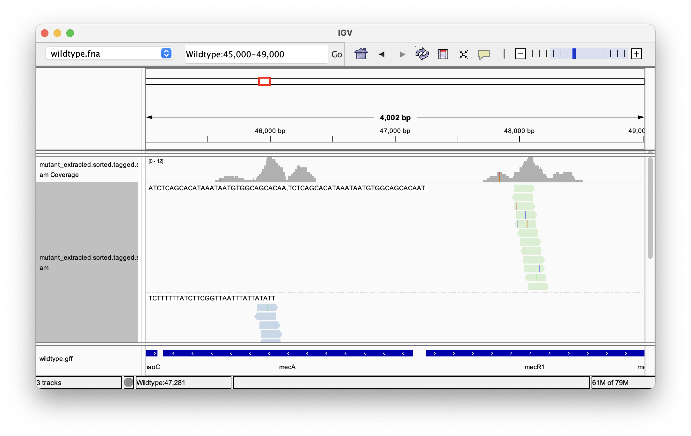

# Practical example/tutorial for MerKurio

- [Practical example/tutorial for MerKurio](#practical-exampletutorial-for-merkurio)
  - [Setup](#setup)
  - [Download the data](#download-the-data)
  - [Extract sequencing reads based on _k_-mers](#extract-sequencing-reads-based-on-k-mers)
  - [Analyzing match statistics](#analyzing-match-statistics)
  - [Aligning the extracted reads](#aligning-the-extracted-reads)
  - [Tagging the aligned reads with _k_-mers](#tagging-the-aligned-reads-with-k-mers)
  - [Visualization of tagged reads](#visualization-of-tagged-reads)

This is a brief demonstration and guide on how MerKurio can be used in practice.

The guide is also available [in the repository](https://github.com/lschoenm/MerKurio/example-workflow), along with the input and output data. 

This tutorial assumes that you have already installed MerKurio on your system. If you haven't done this yet, please refer to the installation section in the documentation. Additionally, the following software is used in this example:

- jq (v1.6)
- Bowtie2 (v2.5.4)
- samtools (v1.22)
- IGV (v2.19.4)

These dependencies are only necessary for parts of the tutorial after read extraction. 

In this guide, we will walk through the following scenario: we have a list of relevant _k_-mers which we have obtained from a fictional association test. We then want to extract all raw sequencing reads from a mutant strain which contain our _k_-mers of interest, using MerKurio. Next, we want to map them to the wildtype reference genome. With MerKurio, we can then tag the aligned reads with the _k_-mers they contain and visualize this information in a genome browser.

## Setup

To install MerKurio, follow the installation instructions [in the Readme](https://github.com/lschoenm/MerKurio?tab=readme-ov-file#installation) or the [official documentation](https://lschoenm.github.io/MerKurio/installation.html). 

If you have `cargo`/Rust installed, you can first clone the repository using `git`. This will download a local copy of the repository to your computer. Then you can install MerKurio from source, which will automatically add it to your PATH: 

```bash
git clone https://github.com/lschoenm/MerKurio
cd MerKurio
cargo install --path .
```

Test the installation by running MerKurio: 

```bash
merkurio --help
```

Alternatively, download a standalone binary from the [releases page](https://github.com/lschoenm/MerKurio/releases). If you don't add `merkurio` to your PATH, you have to call it using the path to the executable. 

## Download the data

A full dataset of _Staphylococcus aureus_ is available from Zenodo/the Galaxy training network under [this link](https://doi.org/10.5281/zenodo.582600). It comprises the reference genome sequence in FASTA format, a list of feature annotations in GFF format, and paired-end sequence reads in FASTQ format.

First, let's create a new directory `data` and download the files by entering the following commands in your terminal:

```bash
mkdir -p data
curl https://zenodo.org/records/582600/files/mutant_R1.fastq > data/mutant_R1.fastq
curl https://zenodo.org/records/582600/files/mutant_R2.fastq > data/mutant_R2.fastq
curl https://zenodo.org/records/582600/files/wildtype.fna > data/wildtype.fna
curl https://zenodo.org/records/582600/files/wildtype.gff > data/wildtype.gff
```

The dataset contains the following files:

- `mutant_R[12].fastq` are the two FASTQ files containing the paired-end sequencing reads (~150 bp long).
- `wildtype.fna` contains an assembled miniature genome of _S. aureus_.
- `wildtype.gff` listing the features of the reference genome.

The genome is from an imaginary _S. aureus_ bacterium. The sequencing reads have around 19x coverage.

## Extract sequencing reads based on _k_-mers

Let's assume that we ran a _k_-mer-based genome-wide association study in _S. aureus_ which identified the following _k_-mers to be significantly associated with antibiotics resistance:

- `AATATAATAAATTAACCGAAGATAAAAAAGA`
- `ATCTCAGCACATAAATAATGTGGCAGCACAA`
- `ATTGTGCTGCCACATTATTTATGTGCTGAGA`

Normally, we would assume that we already have those sequences obtained from previous analyses either in a text file or a FASTA file - both of which are valid input for MerKurio. For this example, we have to createa file `significant_kmers.txt` storing these _k_-mers, one per line. This can be done with the following commands:

```bash
echo AATATAATAAATTAACCGAAGATAAAAAAGA > data/significant_kmers.txt
echo ATCTCAGCACATAAATAATGTGGCAGCACAA >> data/significant_kmers.txt
echo ATTGTGCTGCCACATTATTTATGTGCTGAGA >> data/significant_kmers.txt
```

We can use MerKurio's `extract` subcommand to extract all raw sequencing reads from the mutant _S. aureus_ strain which contain any of these _k_-mers.

The `-o` flag controls the output file suffix, `-i` the path to the first input file. We want to extract read pairs if any of the mates contains one of our _k_-mers. MerKurio automatically switches to paired-end read mode if the second file is provided with the `-2` flag.

Because we do not know from which of the two DNA strands the _k_-mers are coming yet both of them could be represented in the reads, we also have to look for the reverse complements of the query sequences (this is controlled by the `-r` flag).

Additionally, we would also like to generate detailed match statistics describing which _k_-mers were found and their exact locations in the reads, along with a few summary statistics. By providing the `-l` flag without an argument, a log in plain text format is written to the stdout channel of the terminal. Additionally, we can store a log in JSON format by using the `-j` flag with a file path.

```bash
mkdir -p output
mkdir -p logs
merkurio extract -i data/mutant_R1.fastq -2 data/mutant_R2.fastq -f data/significant_kmers.txt -r -o output/mutant_extracted -l -j logs/mutant_extracted.stats.json
```

Here, you can see the statistics log output:

<!-- markdownlint-disable MD033 -->
<details>

```log
#MerKurio extract log
#2025-06-27T14:54:18+02:00[Europe/Vienna]
#Running merkurio version 1.0.0
#Command line: merkurio extract -i mutant_R1.fastq -2 mutant_R2.fastq -f significant_kmers.txt -r -o mutant_extracted -l -j logs/mutant_extracted.stats.json
#Searching for 6 patterns 
#
#File   Record  Pattern Position (zero-based)
mutant_R2.fastq mutant-no_snps.gff-23516/2      ATCTCAGCACATAAATAATGTGGCAGCACAA 30
mutant_R2.fastq mutant-no_snps.gff-23516/2      TCTCAGCACATAAATAATGTGGCAGCACAAT 31
mutant_R2.fastq mutant-no_snps.gff-21992/2      ATTGTGCTGCCACATTATTTATGTGCTGAGA 52
mutant_R2.fastq mutant-no_snps.gff-21992/2      TTGTGCTGCCACATTATTTATGTGCTGAGAT 53
mutant_R2.fastq mutant-no_snps.gff-21086/2      ATCTCAGCACATAAATAATGTGGCAGCACAA 113
mutant_R2.fastq mutant-no_snps.gff-21086/2      TCTCAGCACATAAATAATGTGGCAGCACAAT 114
mutant_R2.fastq mutant-no_snps.gff-21076/2      TCTTTTTTATCTTCGGTTAATTTATTATATT 88
mutant_R2.fastq mutant-no_snps.gff-20088/2      ATCTCAGCACATAAATAATGTGGCAGCACAA 108
mutant_R2.fastq mutant-no_snps.gff-20088/2      TCTCAGCACATAAATAATGTGGCAGCACAAT 109
mutant_R2.fastq mutant-no_snps.gff-18432/2      AATATAATAAATTAACCGAAGATAAAAAAGA 35
mutant_R2.fastq mutant-no_snps.gff-15850/2      TCTTTTTTATCTTCGGTTAATTTATTATATT 29
mutant_R2.fastq mutant-no_snps.gff-14898/2      AATATAATAAATTAACCGAAGATAAAAAAGA 75
mutant_R1.fastq mutant-no_snps.gff-14434/1      TCTTTTTTATCTTCGGTTAATTTATTATATT 66
mutant_R2.fastq mutant-no_snps.gff-13984/2      ATTGTGCTGCCACATTATTTATGTGCTGAGA 113
mutant_R2.fastq mutant-no_snps.gff-13984/2      TTGTGCTGCCACATTATTTATGTGCTGAGAT 114
mutant_R1.fastq mutant-no_snps.gff-12520/1      ATCTCAGCACATAAATAATGTGGCAGCACAA 0
mutant_R1.fastq mutant-no_snps.gff-12520/1      TCTCAGCACATAAATAATGTGGCAGCACAAT 1
mutant_R1.fastq mutant-no_snps.gff-10584/1      AATATAATAAATTAACCGAAGATAAAAAAGA 3
mutant_R1.fastq mutant-no_snps.gff-10384/1      TCTTTTTTATCTTCGGTTAATTTATTATATT 25
mutant_R2.fastq mutant-no_snps.gff-8582/2       ATTGTGCTGCCACATTATTTATGTGCTGAGA 32
mutant_R2.fastq mutant-no_snps.gff-8582/2       TTGTGCTGCCACATTATTTATGTGCTGAGAT 33
mutant_R2.fastq mutant-no_snps.gff-8390/2       TCTTTTTTATCTTCGGTTAATTTATTATATT 14
mutant_R2.fastq mutant-no_snps.gff-7378/2       TCTTTTTTATCTTCGGTTAATTTATTATATT 14
mutant_R2.fastq mutant-no_snps.gff-6398/2       ATTGTGCTGCCACATTATTTATGTGCTGAGA 76
mutant_R2.fastq mutant-no_snps.gff-6398/2       TTGTGCTGCCACATTATTTATGTGCTGAGAT 77
mutant_R1.fastq mutant-no_snps.gff-5520/1       ATCTCAGCACATAAATAATGTGGCAGCACAA 62
mutant_R1.fastq mutant-no_snps.gff-5520/1       TCTCAGCACATAAATAATGTGGCAGCACAAT 63
mutant_R1.fastq mutant-no_snps.gff-5480/1       TCTTTTTTATCTTCGGTTAATTTATTATATT 0
mutant_R2.fastq mutant-no_snps.gff-4756/2       AATATAATAAATTAACCGAAGATAAAAAAGA 113
mutant_R1.fastq mutant-no_snps.gff-3476/1       ATCTCAGCACATAAATAATGTGGCAGCACAA 34
mutant_R1.fastq mutant-no_snps.gff-3476/1       TCTCAGCACATAAATAATGTGGCAGCACAAT 35
mutant_R1.fastq mutant-no_snps.gff-2218/1       TCTTTTTTATCTTCGGTTAATTTATTATATT 51
mutant_R2.fastq mutant-no_snps.gff-2152/2       ATCTCAGCACATAAATAATGTGGCAGCACAA 95
mutant_R2.fastq mutant-no_snps.gff-2152/2       TCTCAGCACATAAATAATGTGGCAGCACAAT 96
mutant_R1.fastq mutant-no_snps.gff-868/1        ATTGTGCTGCCACATTATTTATGTGCTGAGA 8
mutant_R1.fastq mutant-no_snps.gff-868/1        TTGTGCTGCCACATTATTTATGTGCTGAGAT 9
#
#Number of patterns found: 6/6 (100.00 %)
#Pattern        Count
#AATATAATAAATTAACCGAAGATAAAAAAGA        4
#ATCTCAGCACATAAATAATGTGGCAGCACAA        7
#ATTGTGCTGCCACATTATTTATGTGCTGAGA        5
#TCTCAGCACATAAATAATGTGGCAGCACAAT        7
#TCTTTTTTATCTTCGGTTAATTTATTATATT        8
#TTGTGCTGCCACATTATTTATGTGCTGAGAT        5
#
#Total number of records searched: 24960
#Total number of characters searched: 3744000
#Total number of hits: 36
#Number of distinct records with a hit: 24
#
#Total number of hits in file 1: 13
#Total number of hits in file 2: 23
#Number of distinct records with a hit in file 1: 9
#Number of distinct records with a hit in file 2: 15
#Total number of extracted records: 48
```

</details>

## Analyzing match statistics

Now we have the extracted sequencing read pairs (those were either mate contained any _k_-mers) in the files `mutant_extracted_1.fastq` and `mutant_extracted_2.fastq` in the `output/` directory. Additionally, we have stored the same match statistics that just got printed to the screen in the file `mutant_extracted.stats.json` in the `logs/` folder, but in [JSON format](https://json.org) instead of plain text. Because it is structured, the JSON file can easily be parsed by other tools or programming languages, making it simple to be used with e.g. Python or R.

A simple yet powerful command-line processor for JSON files is [`jq`](https://jqlang.org). We can use it to inspect the statistics in more detail, for instance to only print the summary statistics:

```bash
jq '.summary_statistics' logs/mutant_extracted.stats.json
```

```json
{
  "number_of_characters_searched": 3744000,
  "number_of_distinct_records_with_a_hit": 24,
  "number_of_matches": 36,
  "number_of_patterns_found": 6,
  "number_of_patterns_searched": 6,
  "number_of_records_searched": 24960
}
```

If we wanted to do _k_-mer abundance analysis, we can rank _k_-mers by frequency:

```bash
jq -r '.pattern_hit_counts | to_entries | sort_by(.value) | reverse | .[] | "\(.value)\t\(.key)"' logs/mutant_extracted.stats.json
```

```text
8	TCTTTTTTATCTTCGGTTAATTTATTATATT
7	TCTCAGCACATAAATAATGTGGCAGCACAAT
7	ATCTCAGCACATAAATAATGTGGCAGCACAA
5	TTGTGCTGCCACATTATTTATGTGCTGAGAT
5	ATTGTGCTGCCACATTATTTATGTGCTGAGA
4	AATATAATAAATTAACCGAAGATAAAAAAGA
```

Basic calculations are also possible, like calculating the percentage of sequencing reads containing any of our _k_-mers (note that when extracting read pairs, if at least one mate contains a query _k_-mer, the number of extracted reads can be higher than the number of matched reads):

```bash
jq -r '.summary_statistics | "Extraction rate: \((.number_of_distinct_records_with_a_hit/.number_of_records_searched)*100*1000|round/1000)/100% of reads contained target k-mers"' logs/mutant_extracted.stats.json
```

```text
Extraction rate: 0.096/100% of reads contained target k-mers
```

Finally, a more advanced `jq` command that calculates the hit density per read file, i.e., the average number of matches in extracted sequences, rounded to two decimal places:

```bash
jq -r '.paired_end_reads_statistics |
"R1 density: \((.number_of_hits_in_file_1/.number_of_distinct_records_with_a_hit_in_file_1)*100|round/100) hits/read
R2 density: \((.number_of_hits_in_file_2/.number_of_distinct_records_with_a_hit_in_file_2)*100|round/100) hits/read"' \
logs/mutant_extracted.stats.json
```

```text
R1 density: 1.44 hits/read
R2 density: 1.53 hits/read
```

## Aligning the extracted reads

Now we can map the extracted reads back to the wildtype reference genome, for instance using `bowtie2`. As a prerequisite, we have to generate an index for our reference:

```bash
bowtie2-build data/wildtype.fna data/wildtype
```

The extracted reads are aligned with the `--very-sensitive-local` parameter to allow soft-clipping the reads for alignment:

```bash
bowtie2 -x data/wildtype -1 output/mutant_extracted_1.fastq -2 output/mutant_extracted_2.fastq --very-sensitive-local > output/mutant_extracted.sam
```

## Tagging the aligned reads with _k_-mers

It is often a requirement to sort the SAM file by coordinates before doing follow-up analysis. This can be done using `samtools`:

```bash
samtools sort output/mutant_extracted.sam -O sam > output/mutant_extracted.sorted.sam
```

We would like to know which _k_-mers the aligned reads contain. To do so, we can use MerKurio's `tag` subcommand. Again, we are using the `-r` flag to also search for reverse complements:

```bash
merkurio tag -i output/mutant_extracted.sorted.sam -o output/mutant_extracted.sorted.tagged.sam -f data/significant_kmers.txt -r
```

Inspecting the SAM file shows us that the reads are mapped to a region from around 45,000 to 49,000. The _k_-mers contained in aligned sequences are stored under the `km` tag (`Z` denotes a string type, in accordance with the official SAM field specifications):

```bash
less output/mutant_extracted.sorted.tagged.sam
```

Note that we could have also mapped all reads to the reference genome and filter the resulting SAM file to keep only those sequences containing _k_-mers with `merkurio tag -m [...]`, but in a real-life example with up to terabytes of raw sequencing reads this can become unfeasible, and we would not keep the mates of reads with our _k_-mers. Extracting only the relevant reads before mapping can save time and disk space.

## Visualization of tagged reads

The aligned and tagged sequencing reads can be visualized in the Integrative Genome Browser (IGV). Start IGV (by typing `igv` in the terminal) and load the `wildtype.fna` genome, the file with the gene annotations `wildtype.gff`, and the tagged reads `mutant_extracted.sorted.tagged.sam`.

To do so, in the menu select "Genomes → Load Genome from File..." and "File → Load from File...", respectively. IGV might prompt that it must first generate an index for some files.

Now, zoom in on the region of interest by entering the coordinates and clicking "Go": `Wildtype:45,000-49,000`. Right-clicking on the track with the aligned reads and selecting "View as pairs" to group the read pairs. An advantage of our tagged reads is that we can highlight the presence of specific _k_-mers. To do so, press right click on the track, go "Color alignments by → tag" and enter `km`:

<!-- markdownlint-disable MD033 -->
<details>



</details>

Clicking on a single read also shows us its _k_-mer tags. When looking for specific _k_-mers, it can also make sense to group them by tag:

<!-- markdownlint-disable MD033 -->
<details>



</details>

By looking at the track with the gene annotations on the bottom, we can see that the reads mapped to positions in the genes mecA and mecR1, which are expressing a penicillin-binding protein and a methicillin-resistance regulatory protein, respectively. By extracting sequencing reads significantly associated with antibiotics resistance and mapping them back to the reference genome we were able to successfully identify candidate genes for this trait.

Follow-up analysis could include looking for variants (SNPs and indels) present in the tagged reads, or intersecting the gene annotation with the positions of extracted reads.
